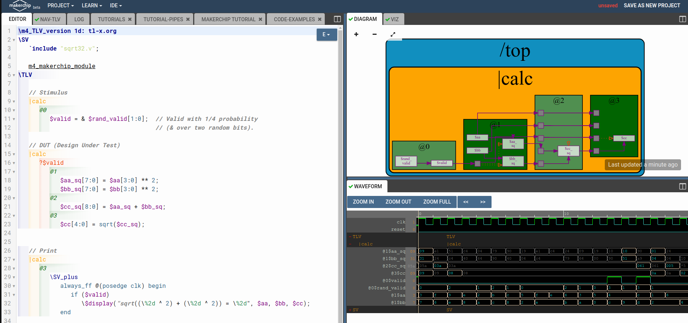
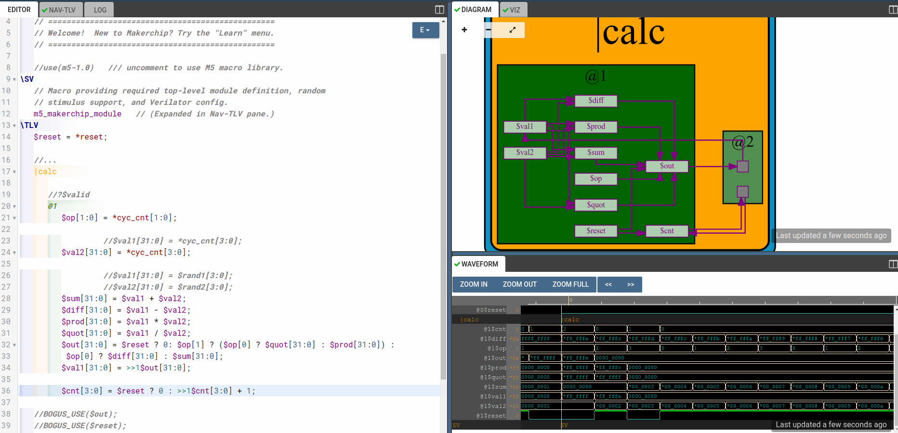

# ASIC Design


## RISCV based Myth

<details>
<summary>DAY-0</summary>

This section describes steps to install and configure RISCV tool chain

```
git clone https://github.com/kunalg123/riscv_workshop_collaterals.git
sudo apt install libboost-regex-dev
cd riscv_workshop_collaterals
chmod 755 run.sh
./run.sh
```

The above commands usually creates a folder called "riscv_toolchain" in home folder. Follow the next commands to access the tool chain from anywhere in terminal. Otherwise, path to bin folder of toolchain has to be provided to execute respective commands.

```
gedit .bashrc
```

At last line of .bashrc

```
export PATH=/home/<username>/riscv_toolchain/riscv64-unknown-elf-gcc-8.3.0-2019.08.0-x86_64-linux-ubuntu14/bin:$PATH
```

Save and close the .bashrc file. Then give following command to apply the changes of .bashrc file.

```
source .bashrc
```


Riscv toolchain installed

</details>

<details>
<summary>DAY-1</summary>

### Overview
This section explains about development of applications on custom hardware architecture and RISCV toolchain.

### Introduction
RISC- Reduced Instruction Set Architecture Computer
We have hardware resources and software codes running on these resources. Compiler is a tool that convert high level code to assembly level code. Assembler is a tool that converts assembly level code to machine level code. The assembly level code is specific to type of architecture used. We will also look into several instructions and concepts such as psuedo instructions, integer RV64I, multiply extenstion RV64M, single & double precision floating point extension, application binary interface, memory allocation and stack pointer.


### GCC compiler and sample usage
Gcc compiler is used to convert C code into machine code for computer to execute. Here is sample commands to compile and execute sample c code.
```
gcc -o code.out code.c
./code.out
```

Following is sample c code for sum of 'n' numbers.
```
#include<stdio.h>
int main()
{
	int n,sum=0;
	printf("Enter n: ");
	scanf("%d",&n);
	for(int i=1;i<=n;i++) {
	sum=sum+i; }
	printf("Sum of %d numbers is %d\n",n,sum);
	return 1;
}
```


### RISCV gcc compilation and assembly code
Folowing command describes the way to compile c code in riscv gcc compiler.
```
riscv64-unknown-elf-gcc -O1 -mabi=lp64 -march=rv64i -o <output>.o <inputfile>.c
```

Following represents way to observe object(compiled assembly code)
```
riscv64-unknown-elf-objdump -d <output>.o
```

If we want a bit optimized version of assembly code we use following option and use same command to observe object file.
```
riscv64-unknown-elf-gcc -Ofast -mabi=lp64 -march=rv64i -o <output>.o <inputfile>.c
```
### Execution of output file in RISCV tool chain
We use following command to execute object file using riscv tool chain.
```
spike pk <output>.o
```


We use following command to debug the output
```
spike -d pk <output>.o
```


We have few commands to execute and observe specific variables or registers during debugging session.
--To run code until a specific location
```
until pc 0 <memory_location>
```

--To observe contents of register in specific core
```
reg <core> <register>
```

Press "Enter" to execute line by line in assembly code.

Press "q" to to quit debugging session.

### Integer floating point representation
Human beings are accustomed to use decimal number system and computers are designed for binary number system. Hence, there is a requirement for conversion of decimal to binary system. Present day computers are designed to handle 64 bit numbers where we usually divide 64 bits into two 32 bits group, each 32 bit group is divided into four 8 bit group, each 8 bit group is divided into either 2 nibbles or simply considered doubleword.

The number of patterns for any 'n' bits is 2^(n).

Signed binary numbers are represented using 2's complement numbers. MSB of a binary number is 0 for positive number and 1 for negative number in any representation.

For unsigned numbers of n bit, range -> 0 to 2^(n)-1.
For signed numbers of n bit, range -> -(2^(n-1)) to (2^(n-1)-1).
Here is sample C code to understand floating representation and highest & lowest value possible in RISCV.

```
#include<stdio.h>
#include<math.h>

int main()
{
	unsigned long long int max=(unsigned long long int) (pow(2,64)-1);
	printf("Highest num represented by unsigned long long integer for 64 bit is %llu\n",max);
	
	max=(unsigned long long int) (pow(2,10)-1);
	printf("Highest num represented by unsigned long long integer for 10 bit is %llu\n",max);
	
	max=(unsigned long long int) (pow(2,127)-1);
	printf("Highest num represented by unsigned long long integer for 127 bit is %llu\n",max);
	
	unsigned long long int min=(unsigned long long int) (pow(2,64)*-1);
	printf("Lowest num represented by unsigned long long integer for 64 bit is %llu\n",min);
	
	long long int max2=(long long int) (pow(2,63)-1);// bug was here type long long int instead of just int in video
	printf("Highest num represented by signed long long integer for 64 bit is %lld\n",max2);
	
	long long int min2=(long long int) (pow(2,63)*-1);// bug was here type long long int instead of just int in video
	printf("Lowest num represented by signed long long integer for 64 bit is %lld\n",min2);
	return 1;
}
```

Following output represents the output for above code.


</details>

<details>
<summary>DAY-2</summary>

### Application Binary Interface

Interface simply refers to appearance & functionality of a system without deeper understanding architecture & implementation.
Ex: Users need to know mainly about appearance of a building rather than construction of the same.

Ex: Programmer need to know strcuture or syntax of a application library rather than its internal implementation.

Application Binary interface uses registers to access hardware resources. 

RISC uses little endian architecture for storing data where most significant byte is in highest memory location.

RISC uses little endian architecture and stores 1 byte in each location. Instructions are 32 bit but data is 64 bit in 64 bit architeciture. It is a byte addressable memory. We specify -march=rv64i as architecture and hence set of integer base instructions.

We have 32 registers in RISCV architecture with x00, x01 and so on as representation.


We have a sample for ABI system call. Following are two codes (C & ASM)

C code

```
#include <stdio.h>

extern int load(int x, int y); 

int main() {
	int result = 0;
       	int count = 3;
    	result = load(0x0, count+1);
    	printf("Sum of number from 1 to %d is %d\n", count, result); 
}
```

load.S

```
.section .text
.global load
.type load, @function

load:
	add 	a4, a0, zero //Initialize sum register a4 with 0x0
	add 	a2, a0, a1   // store count of 10 in register a2. Register a1 is loaded with 0xa (decimal 10) from main program
	add	a3, a0, zero // initialize intermediate sum register a3 by 0
loop:	add 	a4, a3, a4   // Incremental addition
	addi 	a3, a3, 1    // Increment intermediate register by 1	
	blt 	a3, a2, loop // If a3 is less than a2, branch to label named <loop>
	add	a0, a4, zero // Store final result to register a0 so that it can be read by main program
	ret
```

Following is output after compilation & execution of above codes.


### Execution of C code on RISCV CPU Verilog

We have a RISCV design written in verilog. We convert our c code into hex code and simulate and execute it on RISCV CPU code and get back output on terminal. We have all necessary codes in labs folder.


</details>

<details>
<summary>DAY-3</summary>

### Overview
This section describes about TL-verilog and Makerchip platform & its examples.

### Makerchip platform
Makerchip platform is a cloud based web application that takes design input in form of TL-verilog code and provides logical diagram & waveform as output without any testbench provided externally.

### Pythagorean example
We take pythagorean example from platform and execute it to understand its flow. We compile and observe the output on different windows as shown below.


### Few other sample exercise in Maker chip platform (combinational circuits)
Here we consider simple logic gates as examples.


Here we consider example of Full adder to understand use of vectors.


Here we consider example of multiplexer.


Here is example for calculator.


### Sequential circuits in Maker chip platform

Here is example for free counter.


Here is sequential calculator that remembers previous results for next calculation.


### Pipeline 
Pipeline refers to executing in stages. We can divide entire calculation into several stages to have clock frequency unchanged. This is done in TL-verilog by putting @1, @2 before that stage instruction. This is seen in pythagorean example as shown before. 



### Identifiers & tokens
Identifiers are elements used to refer some location or value or signal. There are some rules to be followed to name an identifier. 

-- They must start with two lower case letters. 
lower_case -> pipe signal

CamelCase -> state signal

UPPER_KEY -> keyword signal

-- They must not end with numbers.

-- >> refers to ahead of.

Here is sample pipeline given as lab exercise.


### Calculator & counter pipeline lab



### Cycle calculator


### Validity
Validity is a feature in TL-verilog not available in other RTL languages. It is easier to debug, better error checking and automated clock gatig in TL-verilog. If we have multiple stages of computation, then we use validity to indicate the valid output available to consider it for next set of computations.

### Clock gating
In most of circuits, clock consumes more power as it is generated continuously from clock generator circuit. Clock gating avoids toggling of clock signals. We use condition of validity to perform clock gating.

### Distance calculator
Here we use pythagoras theorem to calculate distance between two points through a given path as shown.


### Calculator with single value memory Lab
Here we modify and design previous calculator to have single value memory and recall use for successive computations.


</details>

<details>
<summary>DAY-4</summary>

### Overview
This section describes about micr-architecture of single cycle RISCV CPU and its various stages which is main aspect of workshop. We develop RSICV core in this section of workshop.

### Simple RISCV Micro-architecture

Here,we implement the following basic blocks:

-Program Counter (PC)

-Instruction Memory

-Instruction Decoder

-Register File Read

-Arithmatic Logic Unit (ALU)

-Register File Write

-Branch


### Next PC lab

Program counter stores address of next instruction.
```
$pc[31:0] = $reset ? 32'b0 : >>1$pc + 32'd4;
```


### Fetch lab
This reads instruction according to address stored in PC.

```
cpu
      @0
         $reset = *reset;
         $pc[31:0] = $reset ? 32'b0 : >>1$pc + 32'd4;
      @1 
         $imem_rd_addr[M4_IMEM_INDEX_CNT-1:0] = $pc[M4_IMEM_INDEX_CNT+1:2];
         $imem_rd_en = !$reset;
         $instr[31:0] = $imem_rd_data[31:0];
         
      ?$imem_rd_en
         @1
            $imem_rd_data[31:0] = /imem[$imem_rd_addr]$instr; 


      // Note: Because of the magic we are using for visualisation, if visualisation is enabled below,
      //       be sure to avoid having unassigned signals (which you might be using for random inputs)
      //       other than those specifically expected in the labs. You'll get strange errors for these.

   
   // Assert these to end simulation (before Makerchip cycle limit).
   *passed = *cyc_cnt > 40;
   *failed = 1'b0;
   
   // Macro instantiations for:
   //  o instruction memory
   //  o register file
   //  o data memory
   //  o CPU visualization
   |cpu
      m4+imem(@1)    // Args: (read stage)
      //m4+rf(@1, @1)  // Args: (read stage, write stage) - if equal, no register bypass is required
      //m4+dmem(@4)    // Args: (read/write stage)
      //m4+myth_fpga(@0)  // Uncomment to run on fpga

   m4+cpu_viz(@4)
```


### Instruction Decode
We decode instruction fetched from memory.
```
|cpu
      @0
         $reset = *reset;
         $pc[31:0] = $reset ? 32'b0 : >>1$pc + 32'd4;
      @1 
         $imem_rd_addr[M4_IMEM_INDEX_CNT-1:0] = $pc[M4_IMEM_INDEX_CNT+1:2];
         $imem_rd_en = !$reset;
         $instr[31:0] = $imem_rd_data[31:0];
         
      ?$imem_rd_en
         @1
            $imem_rd_data[31:0] = /imem[$imem_rd_addr]$instr; 
            
      @1
         $is_u_instr = $instr[6:2] ==? 5'b0x101;
         
         $is_s_instr = $instr[6:2] ==? 5'b0100x;
         
         $is_r_instr = $instr[6:2] ==? 5'b01011 ||
                       $instr[6:2] ==? 5'b011x0 ||
                       $instr[6:2] ==? 5'b10100;
         
         $is_j_instr = $instr[6:2] ==? 5'b11011;
         
         $is_i_instr = $instr[6:2] ==? 5'b0000x ||
                       $instr[6:2] ==? 5'b001x0 ||
                       $instr[6:2] ==? 5'b11001;
         
         $is_b_instr = $instr[6:2] ==? 5'b11000;
         
         
         $imm[31:0] = $is_i_instr ? {{21{$instr[31]}}, $instr[30:20]} :
                      $is_s_instr ? {{21{$instr[31]}}, $instr[30:25], $instr[11:7]} :
                      $is_b_instr ? {{20{$instr[31]}}, $instr[7], $instr[30:25], $instr[11:8], 1'b0} :
                      $is_u_instr ? {$instr[31:12], 12'b0} :
                      $is_j_instr ? {{12{$instr[31]}}, $instr[19:12], $instr[20], $instr[30:21], 1'b0} :
                                    32'b0;
         
         
         $rs2[4:0] = $instr[24:20];
         $rs1[4:0] = $instr[19:15];
         $rd[4:0]  = $instr[11:7];
         $opcode[6:0] = $instr[6:0];
         $func7[6:0] = $instr[31:25];
         $func3[2:0] = $instr[14:12];


      // Note: Because of the magic we are using for visualisation, if visualisation is enabled below,
      //       be sure to avoid having unassigned signals (which you might be using for random inputs)
      //       other than those specifically expected in the labs. You'll get strange errors for these.

   
   // Assert these to end simulation (before Makerchip cycle limit).
   *passed = *cyc_cnt > 40;
   *failed = 1'b0;
   
   // Macro instantiations for:
   //  o instruction memory
   //  o register file
   //  o data memory
   //  o CPU visualization
   |cpu
      m4+imem(@1)    // Args: (read stage)
      //m4+rf(@1, @1)  // Args: (read stage, write stage) - if equal, no register bypass is required
      //m4+dmem(@4)    // Args: (read/write stage)
      //m4+myth_fpga(@0)  // Uncomment to run on fpga

   m4+cpu_viz(@4) 
```


### Instruction types & immediate decode
We have many different types of instructions like Register type, immediate type, store type, jump type and many more. We want to decode the instrcution type and perform operation accordingly on data.

```
|cpu
      @0
         $reset = *reset;
         $pc[31:0] = $reset ? 32'b0 : >>1$pc + 32'd4;
      @1 
         $imem_rd_addr[M4_IMEM_INDEX_CNT-1:0] = $pc[M4_IMEM_INDEX_CNT+1:2];
         $imem_rd_en = !$reset;
         $instr[31:0] = $imem_rd_data[31:0];
         
      ?$imem_rd_en
         @1
            $imem_rd_data[31:0] = /imem[$imem_rd_addr]$instr; 
            
      @1
         $is_u_instr = $instr[6:2] ==? 5'b0x101;
         
         $is_s_instr = $instr[6:2] ==? 5'b0100x;
         
         $is_r_instr = $instr[6:2] ==? 5'b01011 ||
                       $instr[6:2] ==? 5'b011x0 ||
                       $instr[6:2] ==? 5'b10100;
         
         $is_j_instr = $instr[6:2] instruction==? 5'b11011;
         
         $is_i_instr = $instr[6:2] ==? 5'b0000x ||
                       $instr[6:2] ==? 5'b001x0 ||
                       $instr[6:2] ==? 5'b11001;
         
         $is_b_instr = $instr[6:2] ==? 5'b11000;
         
         
         $imm[31:0] = $is_i_instr ? {{21{$instr[31]}}, $instr[30:20]} :
                      $is_s_instr ? {{21{$instr[31]}}, $instr[30:25], $instr[11:7]} :
                      $is_b_instr ? {{20{$instr[31]}}, $instr[7], $instr[30:25], $instr[11:8], 1'b0} :
                      $is_u_instr ? {$instr[31:12], 12'b0} :
                      $is_j_instr ? {{12{$instr[31]}}, $instr[19:12], $instr[20], $instr[30:21], 1'b0} :
                                    32'b0;


      // Note: Because of the magic we are using for visualisation, if visualisation is enabled below,
      //       be sure to avoid having unassigned signals (which you might be using for random inputs)
      //       other than those specifically expected in the labs. You'll get strange errors for these.

   
   // Assert these to end simulation (before Makerchip cycle limit).
   *passed = *cyc_cnt > 40;
   *failed = 1'b0;
   
   // Macro instantiations for:
   //  o instruction memory
   //  o register file
   //  o data memory
   //  o CPU visualization
   |cpu
      m4+imem(@1)    // Args: (read stage)
      //m4+rf(@1, @1)  // Args: (read stage, write stage) - if equal, no register bypass is required
      //m4+dmem(@4)    // Args: (read/write stage)
      //m4+myth_fpga(@0)  // Uncomment to run on fpga

   m4+cpu_viz(@4) 
```


### Instruction field decode
We identify the type of instruction based on combination present in instruction field.

```
|cpu
      @0
         $reset = *reset;
         $pc[31:0] = $reset ? 32'b0 : >>1$pc + 32'd4;
      @1 
         $imem_rd_addr[M4_IMEM_INDEX_CNT-1:0] = $pc[M4_IMEM_INDEX_CNT+1:2];
         $imem_rd_en = !$reset;
         $instr[31:0] = $imem_rd_data[31:0];
         
      ?$imem_rd_en
         @1
            $imem_rd_data[31:0] = /imem[$imem_rd_addr]$instr; 
            
      @1
         $is_u_instr = $instr[6:2] ==? 5'b0x101;
         
         $is_s_instr = $instr[6:2] ==? 5'b0100x;
         
         $is_r_instr = $instr[6:2] ==? 5'b01011 ||
                       $instr[6:2] ==? 5'b011x0 ||
                       $instr[6:2] ==? 5'b10100;
         
         $is_j_instr = $instr[6:2] ==? 5'b11011;
         
         $is_i_instr = $instr[6:2] ==? 5'b0000x ||
                       $instr[6:2] ==? 5'b001x0 ||
                       $instr[6:2] ==? 5'b11001;
         
         $is_b_instr = $instr[6:2] ==? 5'b11000;
         
         
         $imm[31:0] = $is_i_instr ? {{21{$instr[31]}}, $instr[30:20]} :
                      $is_s_instr ? {{21{$instr[31]}}, $instr[30:25], $instr[11:7]} :
                      $is_b_instr ? {{20{$instr[31]}}, $instr[7], $instr[30:25], $instr[11:8], 1'b0} :
                      $is_u_instr ? {$instr[31:12], 12'b0} :
                      $is_j_instr ? {{12{$instr[31]}}, $instr[19:12], $instr[20], $instr[30:21], 1'b0} :
                                    32'b0;
         $opcode[6:0] = $instr[6:0];
         $rs2[4:0] = $instr[24:20];
         $rs1[4:0] = $instr[19:15];
         $rd[4:0]  = $instr[11:7];
         //$opcode[6:0] = $instr[6:0];
         $func7[6:0] = $instr[31:25];
         $func3[2:0] = $instr[14:12];
         
         //instruction field decode
         $rs2_valid = $is_r_instr || $is_s_instr || $is_b_instr;
         ?$rs2_valid
            $rs2[4:0] = $instr[24:20];
            
         $rs1_valid = $is_r_instr || $is_i_instr || $is_s_instr || $is_b_instr;
         ?$rs1_valid
            $rs1[4:0] = $instr[19:15];
         
         $funct3_valid = $is_r_instr || $is_i_instr || $is_s_instr || $is_b_instr;
         ?$funct3_valid
            $funct3[2:0] = $instr[14:12];
            
         $funct7_valid = $is_r_instr ;
         ?$funct7_valid
            $funct7[6:0] = $instr[31:25];
            
         $rd_valid = $is_r_instr || $is_i_instr || $is_u_instr || $is_j_instr;
         ?$rd_valid
            $rd[4:0] = $instr[11:7];


      // Note: Because of the magic we are using for visualisation, if visualisation is enabled below,
      //       be sure to avoid having unassigned signals (which you might be using for random inputs)
      //       other than those specifically expected in the labs. You'll get strange errors for these.

   
   // Assert these to end simulation (before Makerchip cycle limit).
   *passed = *cyc_cnt > 40;
   *failed = 1'b0;
   
   // Macro instantiations for:
   //  o instruction memory
   //  o register file
   //  o data memory
   //  o CPU visualization
   |cpu
      m4+imem(@1)    // Args: (read stage)
      //m4+rf(@1, @1)  // Args: (read stage, write stage) - if equal, no register bypass is required
      //m4+dmem(@4)    // Args: (read/write stage)
      //m4+myth_fpga(@0)  // Uncomment to run on fpga

   m4+cpu_viz(@4)
```


### Instrcution decode final

```
|cpu
      @0
         $reset = *reset;
         $pc[31:0] = $reset ? 32'b0 : >>1$pc + 32'd4;
      @1 
         $imem_rd_addr[M4_IMEM_INDEX_CNT-1:0] = $pc[M4_IMEM_INDEX_CNT+1:2];
         $imem_rd_en = !$reset;
         $instr[31:0] = $imem_rd_data[31:0];
         
      ?$imem_rd_en
         @1
            $imem_rd_data[31:0] = /imem[$imem_rd_addr]$instr; 
            
      @1
         $is_u_instr = $instr[6:2] ==? 5'b0x101;
         
         $is_s_instr = $instr[6:2] ==? 5'b0100x;
         
         $is_r_instr = $instr[6:2] ==? 5'b01011 ||
                       $instr[6:2] ==? 5'b011x0 ||
                       $instr[6:2] ==? 5'b10100;
         
         $is_j_instr = $instr[6:2] ==? 5'b11011;
         
         $is_i_instr = $instr[6:2] ==? 5'b0000x ||
                       $instr[6:2] ==? 5'b001x0 ||
                       $instr[6:2] ==? 5'b11001;
         
         $is_b_instr = $instr[6:2] ==? 5'b11000;
         
         
         $imm[31:0] = $is_i_instr ? {{21{$instr[31]}}, $instr[30:20]} :
                      $is_s_instr ? {{21{$instr[31]}}, $instr[30:25], $instr[11:7]} :
                      $is_b_instr ? {{20{$instr[31]}}, $instr[7], $instr[30:25], $instr[11:8], 1'b0} :
                      $is_u_instr ? {$instr[31:12], 12'b0} :
                      $is_j_instr ? {{12{$instr[31]}}, $instr[19:12], $instr[20], $instr[30:21], 1'b0} :
                                    32'b0;
         $opcode[6:0] = $instr[6:0];
         $rs2[4:0] = $instr[24:20];
         $rs1[4:0] = $instr[19:15];
         $rd[4:0]  = $instr[11:7];
         //$opcode[6:0] = $instr[6:0];
         $func7[6:0] = $instr[31:25];
         $func3[2:0] = $instr[14:12];
         
         //instruction field decode
         $rs2_valid = $is_r_instr || $is_s_instr || $is_b_instr;
         ?$rs2_valid
            $rs2[4:0] = $instr[24:20];
            
         $rs1_valid = $is_r_instr || $is_i_instr || $is_s_instr || $is_b_instr;
         ?$rs1_valid
            $rs1[4:0] = $instr[19:15];
         
         $funct3_valid = $is_r_instr || $is_i_instr || $is_s_instr || $is_b_instr;
         ?$funct3_valid
            $funct3[2:0] = $instr[14:12];
            
         $funct7_valid = $is_r_instr ;
         ?$funct7_valid
            $funct7[6:0] = $instr[31:25];
            
         $rd_valid = $is_r_instr || $is_i_instr || $is_u_instr || $is_j_instr;
         ?$rd_valid
            $rd[4:0] = $instr[11:7];
            
            
         $dec_bits [10:0] = {$funct7[5], $funct3, $opcode};
         $is_beq = $dec_bits ==? 11'bx_000_1100011;
         $is_bne = $dec_bits ==? 11'bx_001_1100011;
         $is_blt = $dec_bits ==? 11'bx_100_1100011;
         $is_bge = $dec_bits ==? 11'bx_101_1100011;
         $is_bltu = $dec_bits ==? 11'bx_110_1100011;
         $is_bgeu = $dec_bits ==? 11'bx_111_1100011;
         $is_addi = $dec_bits ==? 11'bx_000_0010011;
         $is_add = $dec_bits ==? 11'b0_000_0110011;


      // Note: Because of the magic we are using for visualisation, if visualisation is enabled below,
      //       be sure to avoid having unassigned signals (which you might be using for random inputs)
      //       other than those specifically expected in the labs. You'll get strange errors for these.

   
   // Assert these to end simulation (before Makerchip cycle limit).
   *passed = *cyc_cnt > 40;
   *failed = 1'b0;
   
   // Macro instantiations for:
   //  o instruction memory
   //  o register file
   //  o data memory
   //  o CPU visualization
   |cpu
      m4+imem(@1)    // Args: (read stage)
      //m4+rf(@1, @1)  // Args: (read stage, write stage) - if equal, no register bypass is required
      //m4+dmem(@4)    // Args: (read/write stage)
      //m4+myth_fpga(@0)  // Uncomment to run on fpga

   m4+cpu_viz(@4) 
```


### Register file read lab 1

Register file contains various registers used for multiple purposes to interact and compute values with ALU and user.

```
|cpu
      @0
         $reset = *reset;
         $pc[31:0] = $reset ? 32'b0 : >>1$pc + 32'd4;
      @1 
         $imem_rd_addr[M4_IMEM_INDEX_CNT-1:0] = $pc[M4_IMEM_INDEX_CNT+1:2];
         $imem_rd_en = !$reset;
         $instr[31:0] = $imem_rd_data[31:0];
         
      ?$imem_rd_en
         @1
            $imem_rd_data[31:0] = /imem[$imem_rd_addr]$instr; 
            
      @1
         $is_u_instr = $instr[6:2] ==? 5'b0x101;
         
         $is_s_instr = $instr[6:2] ==? 5'b0100x;
         
         $is_r_instr = $instr[6:2] ==? 5'b01011 ||
                       $instr[6:2] ==? 5'b011x0 ||
   -                    $instr[6:2] ==? 5'b10100;
         
         $is_j_instr = $instr[6:2] ==? 5'b11011;
         
         $is_i_instr = $instr[6:2] ==? 5'b0000x ||
                       $instr[6:2] ==? 5'b001x0 ||
                       $instr[6:2] ==? 5'b11001;
         
         $is_b_instr = $instr[6:2] ==? 5'b11000;
         
         
         $imm[31:0] = $is_i_instr ? {{21{$instr[31]}}, $instr[30:20]} :
                      $is_s_instr ? {{21{$instr[31]}}, $instr[30:25], $instr[11:7]} :
                      $is_b_instr ? {{20{$instr[31]}}, $instr[7], $instr[30:25], $instr[11:8], 1'b0} :
                      $is_u_instr ? {$instr[31:12], 12'b0} :
                      $is_j_instr ? {{12{$instr[31]}}, $instr[19:12], $instr[20], $instr[30:21], 1'b0} :
                                    32'b0;
         $opcode[6:0] = $instr[6:0];
         $rs2[4:0] = $instr[24:20];
         $rs1[4:0] = $instr[19:15];
         $rd[4:0]  = $instr[11:7];
         //$opcode[6:0] = $instr[6:0];
         $func7[6:0] = $instr[31:25];
         $func3[2:0] = $instr[14:12];
         
         //instruction field decode
         $rs2_valid = $is_r_instr || $is_s_instr || $is_b_instr;
         ?$rs2_valid
            $rs2[4:0] = $instr[24:20];
            
         $rs1_valid = $is_r_instr || $is_i_instr || $is_s_instr || $is_b_instr;
         ?$rs1_valid
            $rs1[4:0] = $instr[19:15];
         
         $funct3_valid = $is_r_instr || $is_i_instr || $is_s_instr || $is_b_instr;
         ?$funct3_valid
            $funct3[2:0] = $instr[14:12];
            
         $funct7_valid = $is_r_instr ;
         ?$funct7_valid
            $funct7[6:0] = $instr[31:25];
            
         $rd_valid = $is_r_instr || $is_i_instr || $is_u_instr || $is_j_instr;
         ?$rd_valid
            $rd[4:0] = $instr[11:7];
            
            
         $dec_bits [10:0] = {$funct7[5], $funct3, $opcode};
         $is_beq = $dec_bits ==? 11'bx_000_1100011;
         $is_bne = $dec_bits ==? 11'bx_001_1100011;
         $is_blt = $dec_bits ==? 11'bx_100_1100011;
         $is_bge = $dec_bits ==? 11'bx_101_1100011;
         $is_bltu = $dec_bits ==? 11'bx_110_1100011;
         $is_bgeu = $dec_bits ==? 11'bx_111_1100011;
         $is_addi = $dec_bits ==? 11'bx_000_0010011;
         $is_add = $dec_bits ==? 11'b0_000_0110011;
         
         //register file reading
         $rf_wr_en = 1'b0;
         $rf_wr_index[4:0] = 5'b0;
         $rf_wr_data[31:0] = 32'b0;
         $rf_rd_en1 = $rs1_valid;
         $rf_rd_index1[4:0] = $rs1;
         $rf_rd_en2 = $rs2_valid;
         $rf_rd_index2[4:0] = $rs2;


      // Note: Because of the magic we are using for visualisation, if visualisation is enabled below,
      //       be sure to avoid having unassigned signals (which you might be using for random inputs)
      //       other than those specifically expected in the labs. You'll get strange errors for these.

   
   // Assert these to end simulation (before Makerchip cycle limit).
   *passed = *cyc_cnt > 40;
   *failed = 1'b0;
   
   // Macro instantiations for:
   //  o instruction memory
   //  o register file
   //  o data memory
   //  o CPU visualization
   |cpu
      m4+imem(@1)    // Args: (read stage)
      m4+rf(@1, @1)  // Args: (read stage, write stage) - if equal, no register bypass is required
      //m4+dmem(@4)    // Args: (read/write stage)
      //m4+myth_fpga(@0)  // Uncomment to run on fpga

   m4+cpu_viz(@4)  
```


### Register file reading lab 2

```
|cpu
      @0
         $reset = *reset;
         $pc[31:0] = $reset ? 32'b0 : >>1$pc + 32'd4;
      @1 
         $imem_rd_addr[M4_IMEM_INDEX_CNT-1:0] = $pc[M4_IMEM_INDEX_CNT+1:2];
         $imem_rd_en = !$reset;
         $instr[31:0] = $imem_rd_data[31:0];
         
      ?$imem_rd_en
         @1
            $imem_rd_data[31:0] = /imem[$imem_rd_addr]$instr; 
            
      @1
         $is_u_instr = $instr[6:2] ==? 5'b0x101;
         
         $is_s_instr = $instr[6:2] ==? 5'b0100x;
         
         $is_r_instr = $instr[6:2] ==? 5'b01011 ||
                       $instr[6:2] ==? 5'b011x0 ||
                        $instr[6:2] ==? 5'b10100;
         
         $is_j_instr = $instr[6:2] ==? 5'b11011;
         
         $is_i_instr = $instr[6:2] ==? 5'b0000x ||
                       $instr[6:2] ==? 5'b001x0 ||
                       $instr[6:2] ==? 5'b11001;
         
         $is_b_instr = $instr[6:2] ==? 5'b11000;
         
         
         $imm[31:0] = $is_i_instr ? {{21{$instr[31]}}, $instr[30:20]} :
                      $is_s_instr ? {{21{$instr[31]}}, $instr[30:25], $instr[11:7]} :
     -                 $is_b_instr ? {{20{$instr[31]}}, $instr[7], $instr[30:25], $instr[11:8], 1'b0} :
                      $is_u_instr ? {$instr[31:12], 12'b0} :
                      $is_j_instr ? {{12{$instr[31]}}, $instr[19:12], $instr[20], $instr[30:21], 1'b0} :
                                    32'b0;
         $opcode[6:0] = $instr[6:0];
         $rs2[4:0] = $instr[24:20];
         $rs1[4:0] = $instr[19:15];
         $rd[4:0]  = $instr[11:7];
         //$opcode[6:0] = $instr[6:0];
         $func7[6:0] = $instr[31:25];
         $func3[2:0] = $instr[14:12];
         
         //instruction field decode
         $rs2_valid = $is_r_instr || $is_s_instr || $is_b_instr;
         ?$rs2_valid
            $rs2[4:0] = $instr[24:20];
            
         $rs1_valid = $is_r_instr || $is_i_instr || $is_s_instr || $is_b_instr;
         ?$rs1_valid
            $rs1[4:0] = $instr[19:15];
         
         $funct3_valid = $is_r_instr || $is_i_instr || $is_s_instr || $is_b_instr;
         ?$funct3_valid
            $funct3[2:0] = $instr[14:12];
            
         $funct7_valid = $is_r_instr ;
         ?$funct7_valid
            $funct7[6:0] = $instr[31:25];
            
         $rd_valid = $is_r_instr || $is_i_instr || $is_u_instr || $is_j_instr;
         ?$rd_valid
            $rd[4:0] = $instr[11:7];
            
            
         $dec_bits [10:0] = {$funct7[5], $funct3, $opcode};
         $is_beq = $dec_bits ==? 11'bx_000_1100011;
         $is_bne = $dec_bits ==? 11'bx_001_1100011;
         $is_blt = $dec_bits ==? 11'bx_100_1100011;
         $is_bge = $dec_bits ==? 11'bx_101_1100011;
         $is_bltu = $dec_bits ==? 11'bx_110_1100011;
         $is_bgeu = $dec_bits ==? 11'bx_111_1100011;
         $is_addi = $dec_bits ==? 11'bx_000_0010011;
         $is_add = $dec_bits ==? 11'b0_000_0110011;
         
         //register file reading
         $rf_wr_en = 1'b0;
         $rf_wr_index[4:0] = 5'b0;
         $rf_wr_data[31:0] = 32'b0;
         $rf_rd_en1 = $rs1_valid;
         $rf_rd_index1[4:0] = $rs1;
         $rf_rd_en2 = $rs2_valid;
         $rf_rd_index2[4:0] = $rs2;
         
         $src1_value[31:0] = $rf_rd_data1;
         $src2_value[31:0] = $rf_rd_data2;
         
         

      // Note: Because of the magic we are using for visualisation, if visualisation is enabled below,
      //       be sure to avoid having unassigned signals (which you might be using for random inputs)
      //       other than those specifically expected in the labs. You'll get strange errors for these.

   
   // Assert these to end simulation (before Makerchip cycle limit).
   *passed = *cyc_cnt > 40;
   *failed = 1'b0;
   
   // Macro instantiations for:
   //  o instruction memory
   //  o register file
   //  o data memory
   //  o CPU visualization
   |cpu
      m4+imem(@1)    // Args: (read stage)
      m4+rf(@1, @1)  // Args: (read stage, write stage) - if equal, no register bypass is required
      //m4+dmem(@4)    // Args: (read/write stage)
      //m4+myth_fpga(@0)  // Uncomment to run on fpga

   m4+cpu_viz(@4)  
```


### Arithemtic logic unit
This block performs all the logical and mathematical operations inside the CPU. We perform operations on data read from register in previous step.

```
|cpu
      @0
         $reset = *reset;
         $pc[31:0] = $reset ? 32'b0 : >>1$pc + 32'd4;
      @1 
         $imem_rd_addr[M4_IMEM_INDEX_CNT-1:0] = $pc[M4_IMEM_INDEX_CNT+1:2];
         $imem_rd_en = !$reset;
         $instr[31:0] = $imem_rd_data[31:0];
         
      ?$imem_rd_en
         @1
            $imem_rd_data[31:0] = /imem[$imem_rd_addr]$instr; 
            
      @1
         $is_u_instr = $instr[6:2] ==? 5'b0x101;
         
         $is_s_instr = $instr[6:2] ==? 5'b0100x;
         
         $is_r_instr = $instr[6:2] ==? 5'b01011 ||
                       $instr[6:2] ==? 5'b011x0 ||
                        $instr[6:2] ==? 5'b10100;
         
         $is_j_instr = $instr[6:2] ==? 5'b11011;
         
         $is_i_instr = $instr[6:2] ==? 5'b0000x ||
                       $instr[6:2] ==? 5'b001x0 ||
                       $instr[6:2] ==? 5'b11001;
         
         $is_b_instr = $instr[6:2] ==? 5'b11000;
         
         
         $imm[31:0] = $is_i_instr ? {{21{$instr[31]}}, $instr[30:20]} :
                      $is_s_instr ? {{21{$instr[31]}}, $instr[30:25], $instr[11:7]} :
                      $is_b_instr ? {{20{$instr[31]}}, $instr[7], $instr[30:25], $instr[11:8], 1'b0} :
                      $is_u_instr ? {$instr[31:12], 12'b0} :
                      $is_j_instr ? {{12{$instr[31]}}, $instr[19:12], $instr[20], $instr[30:21], 1'b0} :
                                    32'b0;
         $opcode[6:0] = $instr[6:0];
         $rs2[4:0] = $instr[24:20];
         $rs1[4:0] = $instr[19:15];
         $rd[4:0]  = $instr[11:7];
         //$opcode[6:0] = $instr[6:0];
         $func7[6:0] = $instr[31:25];
         $func3[2:0] = $instr[14:12];
         
         //instruction field decode
         $rs2_valid = $is_r_instr || $is_s_instr || $is_b_instr;
         ?$rs2_valid
            $rs2[4:0] = $instr[24:20];
            
         $rs1_valid = $is_r_instr || $is_i_instr || $is_s_instr || $is_b_instr;
         ?$rs1_valid
            $rs1[4:0] = $instr[19:15];
         
         $funct3_valid = $is_r_instr || $is_i_instr || $is_s_instr || $is_b_instr;
         ?$funct3_valid
            $funct3[2:0] = $instr[14:12];
            
         $funct7_valid = $is_r_instr ;
         ?$funct7_valid
            $funct7[6:0] = $instr[31:25];
            
         $rd_valid = $is_r_instr || $is_i_instr || $is_u_instr || $is_j_instr;
         ?$rd_valid
            $rd[4:0] = $instr[11:7];
            
            
         $dec_bits [10:0] = {$funct7[5], $funct3, $opcode};
         $is_beq = $dec_bits ==? 11'bx_000_1100011;
         $is_bne = $dec_bits ==? 11'bx_001_1100011;
         $is_blt = $dec_bits ==? 11'bx_100_1100011;
         $is_bge = $dec_bits ==? 11'bx_101_1100011;
         $is_bltu = $dec_bits ==? 11'bx_110_1100011;
         $is_bgeu = $dec_bits ==? 11'bx_111_1100011;
         $is_addi = $dec_bits ==? 11'bx_000_0010011;
         $is_add = $dec_bits ==? 11'b0_000_0110011;
         
         //register file reading
         $rf_wr_en = 1'b0;
         $rf_wr_index[4:0] = 5'b0;
         $rf_wr_data[31:0] = 32'b0;
         $rf_rd_en1 = $rs1_valid;
         $rf_rd_index1[4:0] = $rs1;
         $rf_rd_en2 = $rs2_valid;
         $rf_rd_index2[4:0] = $rs2;
         
         $src1_value[31:0] = $rf_rd_data1;
         $src2_value[31:0] = $rf_rd_data2;
         
         $result[31:0] = $is_addi ? $src1_value + $imm :
                         $is_add ? $src1_value + $src2_value :
                         32'bx ;

      // Note: Because of the magic we are using for visualisation, if visualisation is enabled below,
      //       be sure to avoid having unassigned signals (which you might be using for random inputs)
      //       other than those specifically expected in the labs. You'll get strange errors for these.

   
   // Assert these to end simulation (before Makerchip cycle limit).
   *passed = *cyc_cnt > 40;
   *failed = 1'b0;
   
   // Macro instantiations for:
   //  o instruction memory
   //  o register file
   //  o data memory
   //  o CPU visualization
   |cpu
      m4+imem(@1)    // Args: (read stage)
      m4+rf(@1, @1)  // Args: (read stage, write stage) - if equal, no register bypass is required
      //m4+dmem(@4)    // Args: (read/write stage)
      //m4+myth_fpga(@0)  // Uncomment to run on fpga

   m4+cpu_viz(@4)
```


### Register file writing lab
We write the data back to register through this exercise after reading the data from register post processing results.

```
|cpu
      @0
         $reset = *reset;
         $pc[31:0] = $reset ? 32'b0 : >>1$pc + 32'd4;
      @1 
         $imem_rd_addr[M4_IMEM_INDEX_CNT-1:0] = $pc[M4_IMEM_INDEX_CNT+1:2];
         $imem_rd_en = !$reset;
         $instr[31:0] = $imem_rd_data[31:0];
         
      ?$imem_rd_en
         @1
            $imem_rd_data[31:0] = /imem[$imem_rd_addr]$instr; 
            
      @1
         $is_u_instr = $instr[6:2] ==? 5'b0x101;
         
         $is_s_instr = $instr[6:2] ==? 5'b0100x;
         
         $is_r_instr = $instr[6:2] ==? 5'b01011 ||
                       $instr[6:2] ==? 5'b011x0 ||
                        $instr[6:2] ==? 5'b10100;
         
         $is_j_instr = $instr[6:2] ==? 5'b11011;
         
         $is_i_instr = $instr[6:2] ==? 5'b0000x ||
                       $instr[6:2] ==? 5'b001x0 ||
                       $instr[6:2] ==? 5'b11001;
         
         $is_b_instr = $instr[6:2] ==? 5'b11000;
         
         
         $imm[31:0] = $is_i_instr ? {{21{$instr[31]}}, $instr[30:20]} :
                      $is_s_instr ? {{21{$instr[31]}}, $instr[30:25], $instr[11:7]} :
                      $is_b_instr ? {{20{$instr[31]}}, $instr[7], $instr[30:25], $instr[11:8], 1'b0} :
                      $is_u_instr ? {$instr[31:12], 12'b0} :
                      $is_j_instr ? {{12{$instr[31]}}, $instr[19:12], $instr[20], $instr[30:21], 1'b0} :
                                    32'b0;
         $opcode[6:0] = $instr[6:0];
         $rs2[4:0] = $instr[24:20];
         $rs1[4:0] = $instr[19:15];
         $rd[4:0]  = $instr[11:7];
         //$opcode[6:0] = $instr[6:0];
         $func7[6:0] = $instr[31:25];
         $func3[2:0] = $instr[14:12];
         
         //instruction field decode
         $rs2_valid = $is_r_instr || $is_s_instr || $is_b_instr;
         ?$rs2_valid
            $rs2[4:0] = $instr[24:20];
            
         $rs1_valid = $is_r_instr || $is_i_instr || $is_s_instr || $is_b_instr;
         ?$rs1_valid
            $rs1[4:0] = $instr[19:15];
         
         $funct3_valid = $is_r_instr || $is_i_instr || $is_s_instr || $is_b_instr;
         ?$funct3_valid
            $funct3[2:0] = $instr[14:12];
            
         $funct7_valid = $is_r_instr ;
         ?$funct7_valid
            $funct7[6:0] = $instr[31:25];
            
         $rd_valid = $is_r_instr || $is_i_instr || $is_u_instr || $is_j_instr;
         ?$rd_valid
            $rd[4:0] = $instr[11:7];
            
            
         $dec_bits [10:0] = {$funct7[5], $funct3, $opcode};
         $is_beq = $dec_bits ==? 11'bx_000_1100011;
         $is_bne = $dec_bits ==? 11'bx_001_1100011;
         $is_blt = $dec_bits ==? 11'bx_100_1100011;
         $is_bge = $dec_bits ==? 11'bx_101_1100011;
         $is_bltu = $dec_bits ==? 11'bx_110_1100011;
         $is_bgeu = $dec_bits ==? 11'bx_111_1100011;
         $is_addi = $dec_bits ==? 11'bx_000_0010011;
         $is_add = $dec_bits ==? 11'b0_000_0110011;
         
         //register file reading
         $rf_wr_en = 1'b0;
         $rf_wr_index[4:0] = 5'b0;
         $rf_wr_data[31:0] = 32'b0;
         $rf_rd_en1 = $rs1_valid;
         $rf_rd_index1[4:0] = $rs1;
         $rf_rd_en2 = $rs2_valid;
         $rf_rd_index2[4:0] = $rs2;
         
         $src1_value[31:0] = $rf_rd_data1;
         $src2_value[31:0] = $rf_rd_data2;
         //alu
         $result[31:0] = $is_addi ? $src1_value + $imm :
                         $is_add ? $src1_value + $src2_value :
                         32'bx ;
                         
         //register file writing
         $rf_wr_en = $rd_valid && $rd != 5'b0;
         $rf_wr_index[4:0] = $rd;
         $rf_wr_data[31:0] = $result;

      // Note: Because of the magic we are using for visualisation, if visualisation is enabled below,
      //       be sure to avoid having unassigned signals (which you might be using for random inputs)
      //       other than those specifically expected in the labs. You'll get strange errors for these.

   
   // Assert these to end simulation (before Makerchip cycle limit).
   *passed = *cyc_cnt > 40;
   *failed = 1'b0;
   
   // Macro instantiations for:
   //  o instruction memory
   //  o register file
   //  o data memory
   //  o CPU visualization
   |cpu
      m4+imem(@1)    // Args: (read stage)
      m4+rf(@1, @1)  // Args: (read stage, write stage) - if equal, no register bypass is required
      //m4+dmem(@4)    // Args: (read/write stage)
      //m4+myth_fpga(@0)  // Uncomment to run on fpga

   m4+cpu_viz(@4) 
```


### Branch instructions lab 1
Branch instructions are used to update PC to execute program present in specific location. Practical example is interrupt in CPU when keyboard or mouse is used.

```
|cpu
      @0
         $reset = *reset;
         $pc[31:0] = $reset ? 32'b0 : >>1$pc + 32'd4;
      @1 
         $imem_rd_addr[M4_IMEM_INDEX_CNT-1:0] = $pc[M4_IMEM_INDEX_CNT+1:2];
         $imem_rd_en = !$reset;
         $instr[31:0] = $imem_rd_data[31:0];
      -   
      ?$imem_rd_en
         @1
            $imem_rd_data[31:0] = /imem[$imem_rd_addr]$instr; 
            
      @1
         $is_u_instr = $instr[6:2] ==? 5'b0x101;
         
         $is_s_instr = $instr[6:2] ==? 5'b0100x;
         
         $is_r_instr = $instr[6:2] ==? 5'b01011 ||
                       $instr[6:2] ==? 5'b011x0 ||
                        $instr[6:2] ==? 5'b10100;
         
         $is_j_instr = $instr[6:2] ==? 5'b11011;
         
         $is_i_instr = $instr[6:2] ==? 5'b0000x ||
                       $instr[6:2] ==? 5'b001x0 ||
                       $instr[6:2] ==? 5'b11001;
         
         $is_b_instr = $instr[6:2] ==? 5'b11000;
         
         
         $imm[31:0] = $is_i_instr ? {{21{$instr[31]}}, $instr[30:20]} :
                      $is_s_instr ? {{21{$instr[31]}}, $instr[30:25], $instr[11:7]} :
                      $is_b_instr ? {{20{$instr[31]}}, $instr[7], $instr[30:25], $instr[11:8], 1'b0} :
                      $is_u_instr ? {$instr[31:12], 12'b0} :
                      $is_j_instr ? {{12{$instr[31]}}, $instr[19:12], $instr[20], $instr[30:21], 1'b0} :
                                    32'b0;
         $opcode[6:0] = $instr[6:0];
         $rs2[4:0] = $instr[24:20];
         $rs1[4:0] = $instr[19:15];
         $rd[4:0]  = $instr[11:7];
         //$opcode[6:0] = $instr[6:0];
         $func7[6:0] = $instr[31:25];
         $func3[2:0] = $instr[14:12];
         
         //instruction field decode
         $rs2_valid = $is_r_instr || $is_s_instr || $is_b_instr;
         ?$rs2_valid
            $rs2[4:0] = $instr[24:20];
            
         $rs1_valid = $is_r_instr || $is_i_instr || $is_s_instr || $is_b_instr;
         ?$rs1_valid
            $rs1[4:0] = $instr[19:15];
         
         $funct3_valid = $is_r_instr || $is_i_instr || $is_s_instr || $is_b_instr;
         ?$funct3_valid
            $funct3[2:0] = $instr[14:12];
            
         $funct7_valid = $is_r_instr ;
         ?$funct7_valid
            $funct7[6:0] = $instr[31:25];
            
         $rd_valid = $is_r_instr || $is_i_instr || $is_u_instr || $is_j_instr;
         ?$rd_valid
            $rd[4:0] = $instr[11:7];
            
            
         $dec_bits [10:0] = {$funct7[5], $funct3, $opcode};
         $is_beq = $dec_bits ==? 11'bx_000_1100011;
         $is_bne = $dec_bits ==? 11'bx_001_1100011;
         $is_blt = $dec_bits ==? 11'bx_100_1100011;
         $is_bge = $dec_bits ==? 11'bx_101_1100011;
         $is_bltu = $dec_bits ==? 11'bx_110_1100011;
         $is_bgeu = $dec_bits ==? 11'bx_111_1100011;
         $is_addi = $dec_bits ==? 11'bx_000_0010011;
         $is_add = $dec_bits ==? 11'b0_000_0110011;
         
         //register file reading
         $rf_wr_en = 1'b0;
         $rf_wr_index[4:0] = 5'b0;
         $rf_wr_data[31:0] = 32'b0;
         $rf_rd_en1 = $rs1_valid;
         $rf_rd_index1[4:0] = $rs1;
         $rf_rd_en2 = $rs2_valid;
         $rf_rd_index2[4:0] = $rs2;
         
         $src1_value[31:0] = $rf_rd_data1;
         $src2_value[31:0] = $rf_rd_data2;
         //alu
         $result[31:0] = $is_addi ? $src1_value + $imm :
                         $is_add ? $src1_value + $src2_value :
                         32'bx ;
                         
         //register file writing
         $rf_wr_en = $rd_valid && $rd != 5'b0;
         $rf_wr_index[4:0] = $rd;
         $rf_wr_data[31:0] = $result;
         
         //branch
         $taken_branch = $is_beq ? ($src1_value == $src2_value):
                         $is_bne ? ($src1_value != $src2_value):
                         $is_blt ? (($src1_value < $src2_value) ^ ($src1_value[31] != $src2_value[31])):
                         $is_bge ? (($src1_value >= $src2_value) ^ ($src1_value[31] != $src2_value[31])):
                         $is_bltu ? ($src1_value < $src2_value):
                         $is_bgeu ? ($src1_value >= $src2_value):
                                    1'b0;

      // Note: Because of the magic we are using for visualisation, if visualisation is enabled below,
      //       be sure to avoid having unassigned signals (which you might be using for random inputs)
      //       other than those specifically expected in the labs. You'll get strange errors for these.

   
   // Assert these to end simulation (before Makerchip cycle limit).
   *passed = *cyc_cnt > 40;
   *failed = 1'b0;
   
   // Macro instantiations for:
   //  o instruction memory
   //  o register file
   //  o data memory
   //  o CPU visualization
   |cpu
      m4+imem(@1)    // Args: (read stage)
      m4+rf(@1, @1)  // Args: (read stage, write stage) - if equal, no register bypass is required
      //m4+dmem(@4)    // Args: (read/write stage)
      //m4+myth_fpga(@0)  // Uncomment to run on fpga

   m4+cpu_viz(@4) 
```


### Branch instruction lab 2

```
|cpu
      @0
         $reset = *reset;
         $pc[31:0] = $reset ? 32'b0 : >>1$pc + 32'd4;
      @1 
         $imem_rd_addr[M4_IMEM_INDEX_CNT-1:0] = $pc[M4_IMEM_INDEX_CNT+1:2];
         $imem_rd_en = !$reset;
         $instr[31:0] = $imem_rd_data[31:0];
         
      ?$imem_rd_en
         @1
            $imem_rd_data[31:0] = /imem[$imem_rd_addr]$instr; 
            
      @1
         $is_u_instr = $instr[6:2] ==? 5'b0x101;
         
         $is_s_instr = $instr[6:2] ==? 5'b0100x;
         
         $is_r_instr = $instr[6:2] ==? 5'b01011 ||
                       $instr[6:2] ==? 5'b011x0 ||
                        $instr[6:2] ==? 5'b10100;
         
         $is_j_instr = $instr[6:2] ==? 5'b11011;
         
         $is_i_instr = $instr[6:2] ==? 5'b0000x ||
                       $instr[6:2] ==? 5'b001x0 ||
                       $instr[6:2] ==? 5'b11001;
         
         $is_b_instr = $instr[6:2] ==? 5'b11000;
         
         
         $imm[31:0] = $is_i_instr ? {{21{$instr[31]}}, $instr[30:20]} :
                      $is_s_instr ? {{21{$instr[31]}}, $instr[30:25], $instr[11:7]} :
                      $is_b_instr ? {{20{$instr[31]}}, $instr[7], $instr[30:25], $instr[11:8], 1'b0} :
                      $is_u_instr ? {$instr[31:12], 12'b0} :
                      $is_j_instr ? {{12{$instr[31]}}, $instr[19:12], $instr[20], $instr[30:21], 1'b0} :
                                    32'b0;
         $opcode[6:0] = $instr[6:0];
         $rs2[4:0] = $instr[24:20];
         $rs1[4:0] = $instr[19:15];
         $rd[4:0]  = $instr[11:7];
         //$opcode[6:0] = $instr[6:0];
         $func7[6:0] = $instr[31:25];
         $func3[2:0] = $instr[14:12];
         
         //instruction field decode
         $rs2_valid = $is_r_instr || $is_s_instr || $is_b_instr;
         ?$rs2_valid
            $rs2[4:0] = $instr[24:20];
            
         $rs1_valid = $is_r_instr || $is_i_instr || $is_s_instr || $is_b_instr;
         ?$rs1_valid
            $rs1[4:0] = $instr[19:15];
         
         $funct3_valid = $is_r_instr || $is_i_instr || $is_s_instr || $is_b_instr;
         ?$funct3_valid
            $funct3[2:0] = $instr[14:12];
            
         $funct7_valid = $is_r_instr ;
         ?$funct7_valid
            $funct7[6:0] = $instr[31:25];
            
         $rd_valid = $is_r_instr || $is_i_instr || $is_u_instr || $is_j_instr;
         ?$rd_valid
            $rd[4:0] = $instr[11:7];
            
            
         $dec_bits [10:0] = {$funct7[5], $funct3, $opcode};
         $is_beq = $dec_bits ==? 11'bx_000_1100011;
         $is_bne = $dec_bits ==? 11'bx_001_1100011;
         $is_blt = $dec_bits ==? 11'bx_100_1100011;
         $is_bge = $dec_bits ==? 11'bx_101_1100011;
         $is_bltu = $dec_bits ==? 11'bx_110_1100011;
         $is_bgeu = $dec_bits ==? 11'bx_111_1100011;
         $is_addi = $dec_bits ==? 11'bx_000_0010011;
         $is_add = $dec_bits ==? 11'b0_000_0110011;
         
         //register file reading
         $rf_wr_en = 1'b0;
         $rf_wr_index[4:0] = 5'b0;
         $rf_wr_data[31:0] = 32'b0;
         $rf_rd_en1 = $rs1_valid;
         $rf_rd_index1[4:0] = $rs1;
         $rf_rd_en2 = $rs2_valid;
         $rf_rd_index2[4:0] = $rs2;
         
         $src1_value[31:0] = $rf_rd_data1;
         $src2_value[31:0] = $rf_rd_data2;
         //alu
         $result[31:0] = $is_addi ? $src1_value + $imm :
                         $is_add ? $src1_value + $src2_value :
                         32'bx ;
                         
         //register file writing
         $rf_wr_en = $rd_valid && $rd != 5'b0;
         $rf_wr_index[4:0] = $rd;
         $rf_wr_data[31:0] = $result;
         
         //branch
         $taken_branch = $is_beq ? ($src1_value == $src2_value):
                         $is_bne ? ($src1_value != $src2_value):
                         $is_blt ? (($src1_value < $src2_value) ^ ($src1_value[31] != $src2_value[31])):
                         $is_bge ? (($src1_value >= $src2_value) ^ ($src1_value[31] != $src2_value[31])):
                         $is_bltu ? ($src1_value < $src2_value):
                         $is_bgeu ? ($src1_value >= $src2_value):
                                    1'b0;
         //addition of branch code
         $br_target_pc[31:0] = $pc +$imm;

      // Note: Because of the magic we are using for visualisation, if visualisation is enabled below,
      //       be sure to avoid having unassigned signals (which you might be using for random inputs)
      //       other than those specifically expected in the labs. You'll get strange errors for these.

   
   // Assert these to end simulation (before Makerchip cycle limit).
   *passed = *cyc_cnt > 40;
   *failed = 1'b0;
   
   // Macro instantiations for:
   //  o instruction memory
   //  o register file
   //  o data memory
   //  o CPU visualization
   |cpu
      m4+imem(@1)    // Args: (read stage)
      m4+rf(@1, @1)  // Args: (read stage, write stage) - if equal, no register bypass is required
      //m4+dmem(@4)    // Args: (read/write stage)
      //m4+myth_fpga(@0)  // Uncomment to run on fpga

   m4+cpu_viz(@4) 
```


### Testbench in Makerchip platform

We can tell makerchip when simulation passess by monitoring value in x10 register.

```
|cpu
      @0
         $reset = *reset;
         $pc[31:0] = $reset ? 32'b0 : >>1$pc + 32'd4;
      @1 
         $imem_rd_addr[M4_IMEM_INDEX_CNT-1:0] = $pc[M4_IMEM_INDEX_CNT+1:2];
         $imem_rd_en = !$reset;
         $instr[31:0] = $imem_rd_data[31:0];
         
      ?$imem_rd_en
         @1
            $imem_rd_data[31:0] = /imem[$imem_rd_addr]$instr; 
            
      @1
         $is_u_instr = $instr[6:2] ==? 5'b0x101;
         
         $is_s_instr = $instr[6:2] ==? 5'b0100x;
         
         $is_r_instr = $instr[6:2] ==? 5'b01011 ||
                       $instr[6:2] ==? 5'b011x0 ||
                        $instr[6:2] ==? 5'b10100;
         
         $is_j_instr = $instr[6:2] ==? 5'b11011;
         
         $is_i_instr = $instr[6:2] ==? 5'b0000x ||
                       $instr[6:2] ==? 5'b001x0 ||
                       $instr[6:2] ==? 5'b11001;
         
         $is_b_instr = $instr[6:2] ==? 5'b11000;
         
         
         $imm[31:0] = $is_i_instr ? {{21{$instr[31]}}, $instr[30:20]} :
                      $is_s_instr ? {{21{$instr[31]}}, $instr[30:25], $instr[11:7]} :
                      $is_b_instr ? {{20{$instr[31]}}, $instr[7], $instr[30:25], $instr[11:8], 1'b0} :
                      $is_u_instr ? {$instr[31:12], 12'b0} :
                      $is_j_instr ? {{12{$instr[31]}}, $instr[19:12], $instr[20], $instr[30:21], 1'b0} :
                                    32'b0;
         $opcode[6:0] = $instr[6:0];
         $rs2[4:0] = $instr[24:20];
         $rs1[4:0] = $instr[19:15];
         $rd[4:0]  = $instr[11:7];
         //$opcode[6:0] = $instr[6:0];
         $func7[6:0] = $instr[31:25];
         $func3[2:0] = $instr[14:12];
         
         //instruction field decode
         $rs2_valid = $is_r_instr || $is_s_instr || $is_b_instr;
         ?$rs2_valid
            $rs2[4:0] = $instr[24:20];
            
         $rs1_valid = $is_r_instr || $is_i_instr || $is_s_instr || $is_b_instr;
         ?$rs1_valid
            $rs1[4:0] = $instr[19:15];
         
         $funct3_valid = $is_r_instr || $is_i_instr || $is_s_instr || $is_b_instr;
         ?$funct3_valid
            $funct3[2:0] = $instr[14:12];
            
         $funct7_valid = $is_r_instr ;
         ?$funct7_valid
            $funct7[6:0] = $instr[31:25];
            
         $rd_valid = $is_r_instr || $is_i_instr || $is_u_instr || $is_j_instr;
         ?$rd_valid
            $rd[4:0] = $instr[11:7];
            
            
         $dec_bits [10:0] = {$funct7[5], $funct3, $opcode};
         $is_beq = $dec_bits ==? 11'bx_000_1100011;
         $is_bne = $dec_bits ==? 11'bx_001_1100011;
         $is_blt = $dec_bits ==? 11'bx_100_1100011;
         $is_bge = $dec_bits ==? 11'bx_101_1100011;
         $is_bltu = $dec_bits ==? 11'bx_110_1100011;
         $is_bgeu = $dec_bits ==? 11'bx_111_1100011;
         $is_addi = $dec_bits ==? 11'bx_000_0010011;
         $is_add = $dec_bits ==? 11'b0_000_0110011;
         
         //register file reading
         $rf_wr_en = 1'b0;
         $rf_wr_index[4:0] = 5'b0;
         $rf_wr_data[31:0] = 32'b0;
         $rf_rd_en1 = $rs1_valid;
         $rf_rd_index1[4:0] = $rs1;
         $rf_rd_en2 = $rs2_valid;
         $rf_rd_index2[4:0] = $rs2;
         
         $src1_value[31:0] = $rf_rd_data1;
         $src2_value[31:0] = $rf_rd_data2;
         //alu
         $result[31:0] = $is_addi ? $src1_value + $imm :
                         $is_add ? $src1_value + $src2_value :
                         32'bx ;
                         
         //register file writing
         $rf_wr_en = $rd_valid && $rd != 5'b0;
         $rf_wr_index[4:0] = $rd;
         $rf_wr_data[31:0] = $result;
         
         //branch
         $taken_branch = $is_beq ? ($src1_value == $src2_value):
                         $is_bne ? ($src1_value != $src2_value):
                         $is_blt ? (($src1_value < $src2_value) ^ ($src1_value[31] != $src2_value[31])):
                         $is_bge ? (($src1_value >= $src2_value) ^ ($src1_value[31] != $src2_value[31])):
                         $is_bltu ? ($src1_value < $src2_value):
                         $is_bgeu ? ($src1_value >= $src2_value):
                                    1'b0;
         //addition of branch code
         $br_target_pc[31:0] = $pc +$imm;

         //testbench
         *passed = |cpu/xreg[10]>>5$value == (1+2+3+4+5+6+7+8+9) ;
      // Note: Because of the magic we are using for visualisation, if visualisation is enabled below,
      //       be sure to avoid having unassigned signals (which you might be using for random inputs)
      //       other than those specifically expected in the labs. You'll get strange errors for these.

   
   // Assert these to end simulation (before Makerchip cycle limit).
   *passed = *cyc_cnt > 40;
   *failed = 1'b0;
   
   // Macro instantiations for:
   //  o instruction memory
   //  o register file
   //  o data memory
   //  o CPU visualization
   |cpu
      m4+imem(@1)    // Args: (read stage)
      m4+rf(@1, @1)  // Args: (read stage, write stage) - if equal, no register bypass is required
      //m4+dmem(@4)    // Args: (read/write stage)
      //m4+myth_fpga(@0)  // Uncomment to run on fpga

   m4+cpu_viz(@4) 
```


Here is visualization for complete core CPU simulation


</details>

<details>
<summary>DAY-5</summary>

### Overview
We implement pipeline techniques & add additional instrcutions in previously developed RISC V core.

### Pipeline
Pipeline technique refers to dividing entire computation into several stages for faster computation. 

```
|cpu
      @0
         $reset = *reset;
      
      //Fetch
         // Next PC
         $pc[31:0] = (>>1$reset) ? '0 : 
                     (>>3$taken_br) ? >>3$br_tgt_pc : >>1$inc_pc;
         
         $imem_rd_en = !$reset;
         $imem_rd_addr[31:0] = $pc[M4_IMEM_INDEX_CNT+1:2];
         
      @1         
         $instr[31:0] = $imem_rd_data[31:0];
         $inc_pc[31:0] = $pc + 32'd4;  
      // Decode   
         $is_i_instr = $instr[6:2] ==? 5'b0000x ||
                       $instr[6:2] ==? 5'b001x0 ||
                       $instr[6:2] == 5'b11001;
         $is_r_instr = $instr[6:2] ==? 5'b01011 ||
                       $instr[6:2] ==? 5'b10100 ||
                       $instr[6:2] ==? 5'b0110x;                       
         $is_b_instr = $instr[6:2] == 5'b11000;
         $is_u_instr = $instr[6:2] == 5'b0x101;
         $is_s_instr = $instr[6:2] == 5'b0100x;
         $is_j_instr = $instr[6:2] == 5'b11011;
         
         $imm[31:0] = $is_i_instr ? { {21{$instr[31]}} , $instr[30:20] } :
                      $is_s_instr ? { {21{$instr[31]}} , $instr[30:25] , $instr[11:8] , $instr[7] } :
                      $is_b_instr ? { {20{$instr[31]}} , $instr[7] , $instr[30:25] , $instr[11:8] , 1'b0} :
                      $is_u_instr ? { $instr[31:12] , 12'b0} : 
                      $is_j_instr ? { {12{$instr[31]}} , $instr[19:12] , $instr[20] , $instr[30:21] , 1'b0} : 32'b0;
         
         $rs2_valid = $is_r_instr || $is_s_instr || $is_b_instr;
         $rs1_valid = $is_r_instr || $is_s_instr || $is_b_instr || $is_i_instr;
         $rd_valid = $is_r_instr || $is_i_instr || $is_u_instr || $is_j_instr;
         $funct3_valid = $is_r_instr || $is_s_instr || $is_b_instr || $is_i_instr;
         $funct7_valid = $is_r_instr;
         
         ?$rs2_valid
            $rs2[4:0] = $instr[24:20];
         ?$rs1_valid
            $rs1[4:0] = $instr[19:15];
         ?$rd_valid
            $rd[4:0] = $instr[11:7];
         ?$funct3_valid
            $funct3[2:0] = $instr[14:12];
         ?$funct7_valid
            $funct7[6:0] = $instr[31:25];
            
         $opcode[6:0] = $instr[6:0];
         
         $dec_bits[10:0] = {$funct7[5],$funct3,$opcode};
         
         // branch instruction
         $is_beq = $dec_bits ==? 11'bx_000_1100011;
         $is_bne = $dec_bits ==? 11'bx_001_1100011;
         $is_blt = $dec_bits ==? 11'bx_100_1100011;
         $is_bge = $dec_bits ==? 11'bx_101_1100011;
         $is_bltu = $dec_bits ==? 11'bx_110_1100011;
         $is_bgeu = $dec_bits ==? 11'bx_111_1100011;
         
         // arithemtic instruction
         $is_add = $dec_bits ==? 11'b0_000_0110011;
         $is_addi = $dec_bits ==? 11'bx_000_0010011;
         $is_or = $dec_bits ==? 11'b0_110_0110011;
         $is_ori = $dec_bits ==? 11'bx_110_0010011;
         $is_xor = $dec_bits ==? 11'b0_100_0110011;
         $is_xori = $dec_bits ==? 11'bx_100_0010011;
         $is_and = $dec_bits ==? 11'b0_111_0110011;
         $is_andi = $dec_bits ==? 11'bx_111_0010011;
         $is_sub = $dec_bits ==? 11'b1_000_0110011;
         $is_slti = $dec_bits ==? 11'bx_010_0010011;
         $is_sltiu = $dec_bits ==? 11'bx_011_0010011;
         $is_slli = $dec_bits ==? 11'b0_001_0010011;
         $is_srli = $dec_bits ==? 11'b0_101_0010011;
         $is_srai = $dec_bits ==? 11'b1_101_0010011;
         $is_sll = $dec_bits ==? 11'b0_001_0110011;
         $is_slt = $dec_bits ==? 11'b0_010_0110011;
         $is_sltu = $dec_bits ==? 11'b0_011_0110011;
         $is_srl = $dec_bits ==? 11'b0_101_0110011;
         $is_sra = $dec_bits ==? 11'b1_101_0110011;
         
         // Load Instruction
         $is_load = $dec_bits ==? 11'bx_xxx_0000011;
         
         // Store Instruction
         $is_sb = $dec_bits ==? 11'bx_000_0100011;
         $is_sh = $dec_bits ==? 11'bx_001_0100011;
         $is_sw = $dec_bits ==? 11'bx_010_0100011;
         
         // Jump Instruction
         $lui = $dec_bits ==? 11'bx_xxx_0110111;
         $auipc = $dec_bits ==? 11'bx_xxx_0010111;
         $jal = $dec_bits ==? 11'bx_xxx_1101111;
         $jalr = $dec_bits ==? 11'bx_000_1100111;
         
      @2   
      // register file Reading
         $rf_rd_en1 = $rs1_valid;
         ?$rf_rd_en1
            $rf_rd_index1[4:0] = $rs1[4:0];
         
         $rf_rd_en2 = $rs2_valid;
         ?$rf_rd_en2
            $rf_rd_index2[4:0] = $rs2[4:0];
            
           
         $br_tgt_pc[31:0] = $pc + $imm;
      
      
         $src1_value[31:0] = ((>>1$rd == $rs1) && >>1$rf_wr_en) ? >>1$result : $rf_rd_data1[31:0];
         $src2_value[31:0] = ((>>1$rd == $rs2) && >>1$rf_wr_en) ? >>1$result : $rf_rd_data2[31:0];
         
      @3   
         
      // alu
         $sltu_result = $src1_value < $src2_value ;
         $sltiu_result = $src1_value < $imm ;
         
         $result[31:0] = $is_addi ? $src1_value + $imm :
                         $is_add ? $src1_value + $src2_value : 
                         $is_or ? $src1_value | $src2_value : 
                         $is_ori ? $src1_value | $imm :
                         $is_xor ? $src1_value ^ $src2_value :
                         $is_xori ? $src1_value ^ $imm :
                         $is_and ? $src1_value & $src2_value :
                         $is_andi ? $src1_value & $imm :
                         $is_sub ? $src1_value - $src2_value :
                         $is_slti ? (($src1_value[31] == $imm[31]) ? $sltiu_result : {31'b0,$src1_value[31]}) :
                         $is_sltiu ? $sltiu_result :
                         $is_slli ? $src1_value << $imm[5:0] :
                         $is_srli ? $src1_value >> $imm[5:0] :
                         $is_srai ? ({{32{$src1_value[31]}}, $src1_value} >> $imm[4:0]) :
                         $is_sll ? $src1_value << $src2_value[4:0] :
                         $is_slt ? (($src1_value[31] == $src2_value[31]) ? $sltu_result : {31'b0,$src1_value[31]}) :
                         $is_sltu ? $sltu_result :
                         $is_srl ? $src1_value >> $src2_value[5:0] :
                         $is_sra ? ({{32{$src1_value[31]}}, $src1_value} >> $src2_value[4:0]) :
                         $lui ? ({$imm[31:12], 12'b0}) :
                         $auipc ? $pc + $imm :
                         $jal ? $pc + 4 :
                         $jalr ? $pc + 4 : 32'bx;
                         
      // Register File Writting
         $rf_wr_en = $valid ? (($rd == 5'b0) ? 1'b0 : $rd_valid) : 1'b0;     
         ?$rf_wr_en
            $rf_wr_index[4:0] = $rd[4:0];
      
         $rf_wr_data[31:0] = $result[31:0];
      
      // Branching
         $taken_br = $is_beq ? ($src1_value == $src2_value) :
                     $is_bne ? ($src1_value != $src2_value) :
                     $is_blt ? (($src1_value < $src2_value) ^ ($src1_value[31] != $src2_value[31])) :
                     $is_bge ? (($src1_value >= $src2_value) ^ ($src1_value[31] != $src2_value[31])) :
                     $is_bltu ? ($src1_value < $src2_value) :
                     $is_bgeu ? ($src1_value >= $src2_value) : 1'b0;
                     
         $valid_taken_br = $valid && $taken_br;
         $valid = !(>>1$valid_taken_br || >>2$valid_taken_br);
         
         
         
      // Note: Because of the magic we are using for visualisation, if visualisation is enabled below,
      //       be sure to avoid having unassigned signals (which you might be using for random inputs)
      //       other than those specifically expected in the labs. You'll get strange errors for these.

         `BOGUS_USE($is_beq $is_bne $is_blt $is_bge $is_bltu $is_bgeu)
   // Assert these to end simulation (before Makerchip cycle limit).
   *passed = |cpu/xreg[10]>>5$value == (1+2+3+4+5+6+7+8+9);
   *failed = 1'b0;
   
   // Macro instantiations for:
   //  o instruction memory
   //  o register file
   //  o data memory
   //  o CPU visualization
   |cpu
      m4+imem(@1)    // Args: (read stage)
      m4+rf(@2, @3)  // Args: (read stage, write stage) - if equal, no register bypass is required
      //m4+dmem(@4)    // Args: (read/write stage)
   
   m4+cpu_viz(@4) 
```


### Load and store instructions

Adding load instructions with 3 cycle stages like branch instructions. We update previous design with following lines to implement load instrcutions and add testbench to check if sum of 10 numbers is present in x17 reg from data memory.

```
    $is_load = $dec_bits ==? 11'bx_xxx_0000011;
```

```
 $valid_load = $valid && $is_load;
         $valid = !(>>1$valid_taken_br || >>2$valid_taken_br || >>1$valid_load || >>2$valid_load);
         
 @4
         $dmem_rd_en = $valid_load;
         $dmem_wr_en = $valid && $is_s_instr;
         $dmem_addr[3:0] = $result[5:2];
         $dmem_wr_data[31:0] = $src2_value[31:0];
         
      @5   
         $ld_data[31:0] = $dmem_rd_data[31:0];
```


### Final RISCV CPU
After implementing many techniques &  instructions, we have the RISCV CPU core design in TL-verilog ready for execuitng instructions to perform task for RV32I instruction set seen in day 2 of workshop.

```
\m4_TLV_version 1d: tl-x.org
\SV
   // This code can be found in: https://github.com/stevehoover/RISC-V_MYTH_Workshop
   
   m4_include_lib(['https://raw.githubusercontent.com/BalaDhinesh/RISC-V_MYTH_Workshop/master/tlv_lib/risc-v_shell_lib.tlv'])

\SV
   m4_makerchip_module   // (Expanded in Nav-TLV pane.)
\TLV

   // /====================\
   // | Sum 1 to 9 Program |
   // \====================/
   //
   // Program for MYTH Workshop to test RV32I
   // Add 1,2,3,...,9 (in that order).
   //
   // Regs:
   //  r10 (a0): In: 0, Out: final sum
   //  r12 (a2): 10
   //  r13 (a3): 1..10
   //  r14 (a4): Sum
   // 
   // External to function:
   m4_asm(ADD, r10, r0, r0)             // Initialize r10 (a0) to 0.
   // Function:
   m4_asm(ADD, r14, r10, r0)            // Initialize sum register a4 with 0x0
   m4_asm(ADDI, r12, r10, 1010)         // Store count of 10 in register a2.
   m4_asm(ADD, r13, r10, r0)            // Initialize intermediate sum register a3 with 0
   // Loop:
   m4_asm(ADD, r14, r13, r14)           // Incremental addition
   m4_asm(ADDI, r13, r13, 1)            // Increment intermediate register by 1
   m4_asm(BLT, r13, r12, 1111111111000) // If a3 is less than a2, branch to label named <loop>
   m4_asm(ADD, r10, r14, r0)            // Store final result to register a0 so that it can be read by main program
   
   // Optional:
   // m4_asm(JAL, r7, 00000000000000000000) // Done. Jump to itself (infinite loop). (Up to 20-bit signed immediate plus implicit 0 bit (unlike JALR) provides byte address; last immediate bit should also be 0)
   m4_define_hier(['M4_IMEM'], M4_NUM_INSTRS)

   |cpu
      @0
         $reset = *reset;
      
      //Fetch
         // Next PC
         $pc[31:0] = (>>1$reset) ? '0 : 
                     (>>3$valid_taken_br) ? >>3$br_tgt_pc : 
                     (>>3$valid_load) ? >>3$inc_pc : 
                     (>>3$valid_jump && >>3$is_jal) ? >>3$br_tgt_pc :
                     (>>3$valid_jump && >>3$is_jalr) ? >>3$jalr_tgt_pc : >>1$inc_pc;
         
         $imem_rd_en = !$reset;
         $imem_rd_addr[31:0] = $pc[M4_IMEM_INDEX_CNT+1:2];
         
      @1         
         $instr[31:0] = $imem_rd_data[31:0];
         $inc_pc[31:0] = $pc + 32'd4;  
      // Decode   
         $is_i_instr = $instr[6:2] ==? 5'b0000x ||
                       $instr[6:2] ==? 5'b001x0 ||
                       $instr[6:2] == 5'b11001;
         $is_r_instr = $instr[6:2] ==? 5'b01011 ||
                       $instr[6:2] ==? 5'b10100 ||
                       $instr[6:2] ==? 5'b0110x;                       
         $is_b_instr = $instr[6:2] == 5'b11000;
         $is_u_instr = $instr[6:2] == 5'b0x101;
         $is_s_instr = $instr[6:2] == 5'b0100x;
         $is_j_instr = $instr[6:2] == 5'b11011;
         
         $imm[31:0] = $is_i_instr ? { {21{$instr[31]}} , $instr[30:20] } :
                      $is_s_instr ? { {21{$instr[31]}} , $instr[30:25] , $instr[11:8] , $instr[7] } :
                      $is_b_instr ? { {20{$instr[31]}} , $instr[7] , $instr[30:25] , $instr[11:8] , 1'b0} :
                      $is_u_instr ? { $instr[31:12] , 12'b0} : 
                      $is_j_instr ? { {12{$instr[31]}} , $instr[19:12] , $instr[20] , $instr[30:21] , 1'b0} : 32'b0;
         
         $rs2_valid = $is_r_instr || $is_s_instr || $is_b_instr;
         $rs1_valid = $is_r_instr || $is_s_instr || $is_b_instr || $is_i_instr;
         $rd_valid = $is_r_instr || $is_i_instr || $is_u_instr || $is_j_instr;
         $funct3_valid = $is_r_instr || $is_s_instr || $is_b_instr || $is_i_instr;
         $funct7_valid = $is_r_instr;
         
         ?$rs2_valid
            $rs2[4:0] = $instr[24:20];
         ?$rs1_valid
            $rs1[4:0] = $instr[19:15];
         ?$rd_valid
            $rd[4:0] = $instr[11:7];
         ?$funct3_valid
            $funct3[2:0] = $instr[14:12];
         ?$funct7_valid
            $funct7[6:0] = $instr[31:25];
            
         $opcode[6:0] = $instr[6:0];
         
         $dec_bits[10:0] = {$funct7[5],$funct3,$opcode};
         
         // Branch Instruction
         $is_beq = $dec_bits ==? 11'bx_000_1100011;
         $is_bne = $dec_bits ==? 11'bx_001_1100011;
         $is_blt = $dec_bits ==? 11'bx_100_1100011;
         $is_bge = $dec_bits ==? 11'bx_101_1100011;
         $is_bltu = $dec_bits ==? 11'bx_110_1100011;
         $is_bgeu = $dec_bits ==? 11'bx_111_1100011;
         
         // Arithmetic Instruction
         $is_add = $dec_bits ==? 11'b0_000_0110011;
         $is_addi = $dec_bits ==? 11'bx_000_0010011;
         $is_or = $dec_bits ==? 11'b0_110_0110011;
         $is_ori = $dec_bits ==? 11'bx_110_0010011;
         $is_xor = $dec_bits ==? 11'b0_100_0110011;
         $is_xori = $dec_bits ==? 11'bx_100_0010011;
         $is_and = $dec_bits ==? 11'b0_111_0110011;
         $is_andi = $dec_bits ==? 11'bx_111_0010011;
         $is_sub = $dec_bits ==? 11'b1_000_0110011;
         $is_slti = $dec_bits ==? 11'bx_010_0010011;
         $is_sltiu = $dec_bits ==? 11'bx_011_0010011;
         $is_slli = $dec_bits ==? 11'b0_001_0010011;
         $is_srli = $dec_bits ==? 11'b0_101_0010011;
         $is_srai = $dec_bits ==? 11'b1_101_0010011;
         $is_sll = $dec_bits ==? 11'b0_001_0110011;
         $is_slt = $dec_bits ==? 11'b0_010_0110011;
         $is_sltu = $dec_bits ==? 11'b0_011_0110011;
         $is_srl = $dec_bits ==? 11'b0_101_0110011;
         $is_sra = $dec_bits ==? 11'b1_101_0110011;
         
         // Load Instruction
         $is_load = $dec_bits ==? 11'bx_xxx_0000011;
         
         // Store Instruction
         $is_sb = $dec_bits ==? 11'bx_000_0100011;
         $is_sh = $dec_bits ==? 11'bx_001_0100011;
         $is_sw = $dec_bits ==? 11'bx_010_0100011;
         
         // Jump Instruction
         $is_lui = $dec_bits ==? 11'bx_xxx_0110111;
         $is_auipc = $dec_bits ==? 11'bx_xxx_0010111;
         $is_jal = $dec_bits ==? 11'bx_xxx_1101111;
         $is_jalr = $dec_bits ==? 11'bx_000_1100111;
         
         $is_jump = $is_jal || $is_jalr;
         
      @2   
      // Register File Read
         $rf_rd_en1 = $rs1_valid;
         ?$rf_rd_en1
            $rf_rd_index1[4:0] = $rs1[4:0];
         
         $rf_rd_en2 = $rs2_valid;
         ?$rf_rd_en2
            $rf_rd_index2[4:0] = $rs2[4:0];
            
      // Branch Target PC       
         $br_tgt_pc[31:0] = $pc + $imm;
      
      // Jump Target PC
         $jalr_tgt_pc[31:0] = $src1_value + $imm;
         
      // Input signals to ALU
         $src1_value[31:0] = ((>>1$rd == $rs1) && >>1$rf_wr_en) ? >>1$result : $rf_rd_data1[31:0];
         $src2_value[31:0] = ((>>1$rd == $rs2) && >>1$rf_wr_en) ? >>1$result : $rf_rd_data2[31:0];
         
      @3   
         
      // ALU
         $sltu_result = $src1_value < $src2_value ;
         $sltiu_result = $src1_value < $imm ;
         
         $result[31:0] = $is_addi ? $src1_value + $imm :
                         $is_add ? $src1_value + $src2_value : 
                         $is_or ? $src1_value | $src2_value : 
                         $is_ori ? $src1_value | $imm :
                         $is_xor ? $src1_value ^ $src2_value :
                         $is_xori ? $src1_value ^ $imm :
                         $is_and ? $src1_value & $src2_value :
                         $is_andi ? $src1_value & $imm :
                         $is_sub ? $src1_value - $src2_value :
                         $is_slti ? (($src1_value[31] == $imm[31]) ? $sltiu_result : {31'b0,$src1_value[31]}) :
                         $is_sltiu ? $sltiu_result :
                         $is_slli ? $src1_value << $imm[5:0] :
                         $is_srli ? $src1_value >> $imm[5:0] :
                         $is_srai ? ({{32{$src1_value[31]}}, $src1_value} >> $imm[4:0]) :
                         $is_sll ? $src1_value << $src2_value[4:0] :
                         $is_slt ? (($src1_value[31] == $src2_value[31]) ? $sltu_result : {31'b0,$src1_value[31]}) :
                         $is_sltu ? $sltu_result :
                         $is_srl ? $src1_value >> $src2_value[5:0] :
                         $is_sra ? ({{32{$src1_value[31]}}, $src1_value} >> $src2_value[4:0]) :
                         $is_lui ? ({$imm[31:12], 12'b0}) :
                         $is_auipc ? $pc + $imm :
                         $is_jal ? $pc + $imm :
                         $is_jalr ? $pc + $imm : 
                         ($is_load || $is_s_instr) ? $src1_value + $imm : 32'bx;
                         
      // Register File Write
         $rf_wr_en = ($rd_valid && $valid && $rd != 5'b0) || >>2$valid_load;
         ?$rf_wr_en
            $rf_wr_index[4:0] = !$valid ? >>2$rd[4:0] : $rd[4:0];
      
         $rf_wr_data[31:0] = !$valid ? >>2$ld_data[31:0] : $result[31:0];
      
      // Branch
         $taken_br = $is_beq ? ($src1_value == $src2_value) :
                     $is_bne ? ($src1_value != $src2_value) :
                     $is_blt ? (($src1_value < $src2_value) ^ ($src1_value[31] != $src2_value[31])) :
                     $is_bge ? (($src1_value >= $src2_value) ^ ($src1_value[31] != $src2_value[31])) :
                     $is_bltu ? ($src1_value < $src2_value) :
                     $is_bgeu ? ($src1_value >= $src2_value) : 1'b0;
                     
         $valid_taken_br = $valid && $taken_br;
         
      // Load
         $valid_load = $valid && $is_load;
         $valid = !(>>1$valid_taken_br || >>2$valid_taken_br || >>1$valid_load || >>2$valid_load || >>1$valid_jump || >>2$valid_jump);
      
      // Jump
         $valid_jump = $valid && $is_jump;
                  
      @4
         $dmem_rd_en = $valid_load;
         $dmem_wr_en = $valid && $is_s_instr;
         $dmem_addr[3:0] = $result[5:2];
         $dmem_wr_data[31:0] = $src2_value[31:0];
         
      @5   
         $ld_data[31:0] = $dmem_rd_data[31:0];
         
      // Note: Because of the magic we are using for visualisation, if visualisation is enabled below,
      //       be sure to avoid having unassigned signals (which you might be using for random inputs)
      //       other than those specifically expected in the labs. You'll get strange errors for these.

         `BOGUS_USE($is_beq $is_bne $is_blt $is_bge $is_bltu $is_bgeu)
   // Assert these to end simulation (before Makerchip cycle limit).
   *passed = |cpu/xreg[17]>>5$value == (1+2+3+4+5+6+7+8+9);
   *failed = 1'b0;
   
   // Macro instantiations for:
   //  o instruction memory
   //  o register file
   //  o data memory
   //  o CPU visualization
   |cpu
      m4+imem(@1)    // Args: (read stage)
      m4+rf(@2, @3)  // Args: (read stage, write stage) - if equal, no register bypass is required
      m4+dmem(@4)    // Args: (read/write stage)
   
   m4+cpu_viz(@4) 
\SV
   endmodule
```


</details

<details>
<summary>REFERENCES</summary>

    
https://steveicarus.github.io/iverilog/

https://github.com/kunalg123/

https://github.com/stevehoover/RISC-V_MYTH_Workshop

https://github.com/shivanishah269/risc-v-core/


</details>
